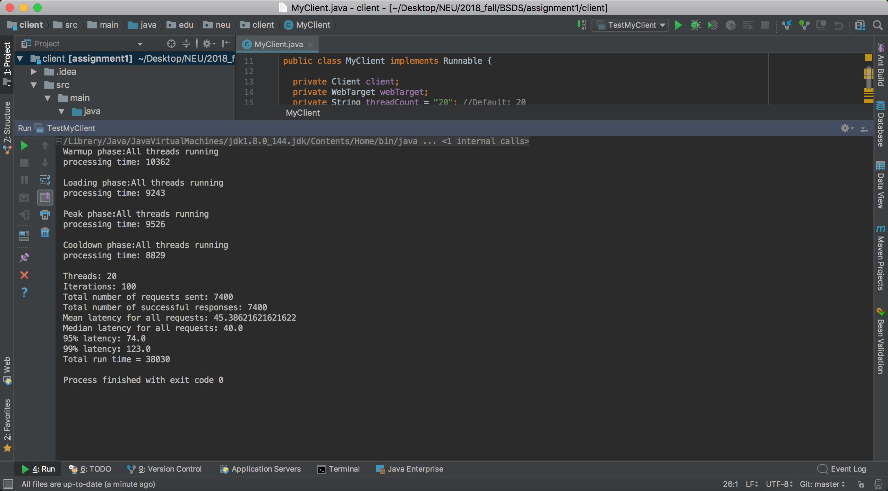

# CS 6650 Assignment 1

###### Shujian Wen

1. A 1 page overview of your design (a simple block diagram would suffice). The aim is to 

   quickly summarize your design so emphasize important components and abstractions.

   

2. URL to your git repo: https://github.com/Greatjian/CS_6650_distributed_system

3. Two screenshots for step 4 showing correct execution and completion of the two 

   specified tests

   - 20 threads, 100 iterations

   

   - 100 threads, 100 iterations

   

4. Two screenshots for step 5 showing correct execution and completion of the two specified tests against your EC2 server instance. If you use an additional tool like a spreadsheet, show the results in this in addition to the two screenshots showing the test running.

   same as above

5. Two screenshots for step 6 showing correct execution and completion of the two specified tests against your AWS Lambda server. If you use an additional tool like a spreadsheet, show the results in this in addition to the two screenshots showing the test running.

   - 20 threads, 100 iterations

     

   - 100 threads, 100 iterations