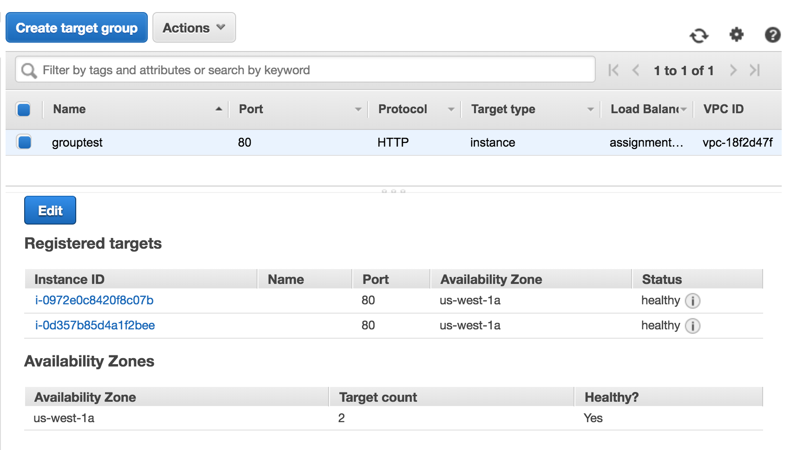
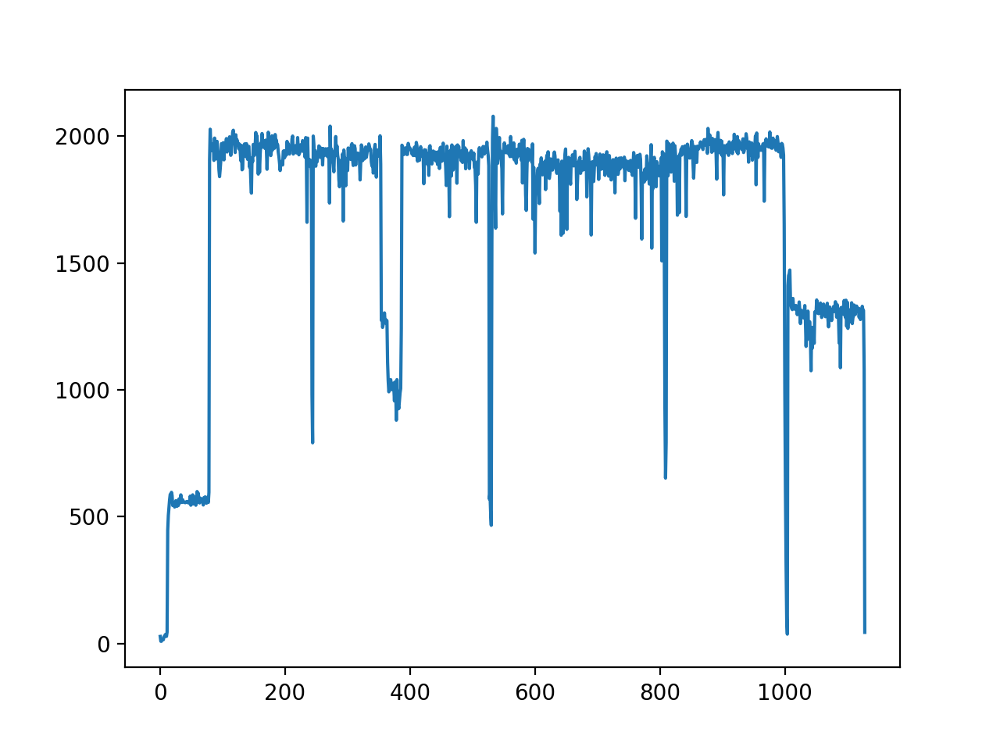

# CS 6650 Assignment 2

###### Shujian Wen

- Assignment 2 codes are available at my github repo: https://github.com/Greatjian/CS_6650_distributed_system

  ## Performance test

|                    | Warmup | Loading | Peak    | Cooldown | Total    |
| ------------------ | ------ | ------- | ------- | -------- | -------- |
| regular 32         | 61.039 | 103.544 | 253.285 | 103.95   | 521.824  |
| load balancing 32  | 61.203 | 105.307 | 252.458 | 100.657  | 519.629  |
| regular 64         | 60.796 | 114.965 | 276.93  | 102.873  | 555.58   |
| load balancing 64  | 60.404 | 117.35  | 272.889 | 102.652  | 553.301  |
| regular 128        | 61.373 | 123.873 | 394.893 | 117.773  | 697.916  |
| load balancing 128 | 61.479 | 126.7   | 390.976 | 117.489  | 696.65   |
| regular 256        | 78.264 | 165.795 | 760.424 | 123.325  | 1127.815 |
| load balancing 256 | 78.634 | 166.142 | 741.485 | 125.694  | 1112.233 |

## Plot

- load balancing: two instance, improvement is limited
- for 256 threads, both regular and load balancing reach a maximum throughput of 2000 per second, making the loading phase and peak phase in the same level

- regular: 32, 64, 128, 256

- load balacing: 32, 64, 128, 256

  

