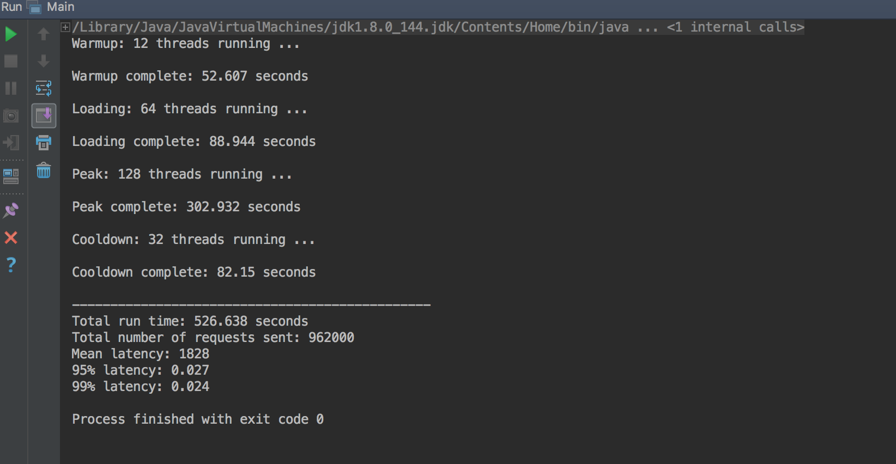
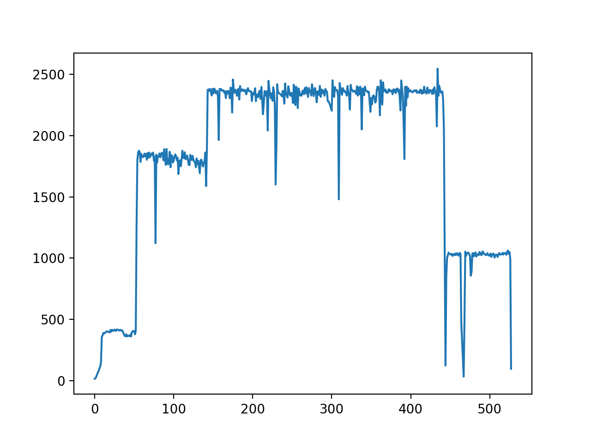

# BSDS Assignment 3

###### Shujian Wen, Wenbo Wang

## Results

- Codes are available at my github repo: https://github.com/Greatjian/CS_6650_distributed_system

|                    | 32   | 64   | 128  | 256  |
| ------------------ | ---- | ---- | ---- | ---- |
| aws (assignment 2) | 521  | 555  | 697  | 1127 |
| aws lambda         | 812  | 906  | 1089 | 1296 |
| gcp                | 377  | 423  | 525  | 887  |
| gcp load_balancing | 387  | 414  | 526  | 893  |

- From the table, we can see:
  - gcp (without lb) $\approx$ gcp (with lb) < aws < aws lambda
  - load balancing contributes little work
  - gcp has an upper limit of 2500 throughput at 256 threads (see pic below) 

## AWS Lambda

- eclipse setup

- use API gateway to implement requests

- throughput

## GCP

- without load balancing

- load balancing setup

